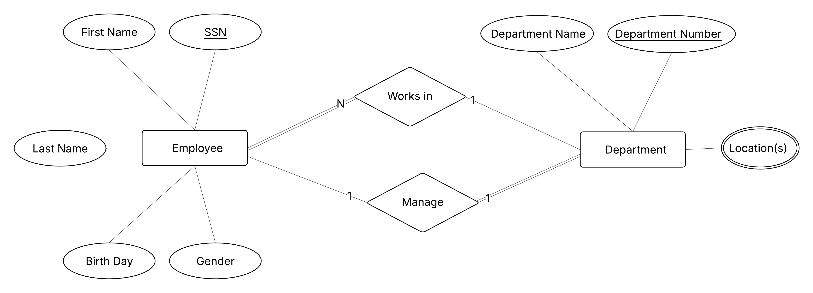

# Database Design Practice

Welcome to **Database Design Practice**!  
This repository is built to help you learn database design by practice.

---

## Table of Contents
- [Purpose](#purpose)  
- [Who is this for?](#who-is-this-for)  
- [How to Use](#how-to-use)  
- [Problem 01: Company Employees and Departments](#problem-01-company-employees-and-departments)  
- [Solution 01: Company Employees and Departments](#solution-01-company-employees-and-departments)  

---

## Purpose
- Practice creating **Entity Relationship Diagrams (ERDs)**  
- Work on **simple, real-world scenarios**  
- Build skills step by step with **guided problems and solutions**  

---

## Who is this for?
- Absolute beginners in database design  
- Students or self-learners looking for hands-on ERD practice  
- Anyone who wants to strengthen their fundamentals in database design  

---

## How to Use
All problems and solutions are included directly in this README.  

1. Read a **Problem** section.  
2. Try to solve it on your own by identifying entities, attributes, and relationships.  
3. Draw your own ERD diagram.  
4. Scroll down to the matching **Solution** section to compare with the provided answer.  

---

## Problem 01: Company Employees and Departments

### Description
A company wants to store information about its employees and departments.  
You are asked to design an ERD for the following scenario:

- Each employee has: SSN, First Name, Last Name, Birth Date, and Gender.  
- Each department has: Department Number (unique), Department Name, and Location(s).  
- Each employee works in exactly one department.  
- A department can have multiple employees.  
- Each department has one manager.  

### Requirements
1. Identify the entities.  
2. Identify the attributes for each entity.  
3. Define the relationships between entities.  
4. Draw the ERD diagram.  
5. Map the ERD to relational schema.  
6. Write SQL code in PostgreSQL to create the schema.  

---

## Solution 01: Company Employees and Departments

### Entities and Attributes
- **Employee**
  - SSN (Primary Key)  
  - First Name  
  - Last Name  
  - Birth Date  
  - Gender  

- **Department**
  - Department Number (Primary Key)  
  - Department Name  
  - Location  

### Relationships
- **Works_In**: Each employee works in one department (1:N).  
- **Manages**: Each department has one manager (1:1 between Department and Employee).  

### ERD Diagram


### ER-to-Relational Mapping
- **Employee(SSN, FirstName, LastName, BirthDate, Gender, DeptNo)**  
- **Department(DeptNo, DeptName, Location, ManagerSSN)**  

### PostgreSQL Implementation
```sql
-- Create Department table
CREATE TABLE Department (
    DeptNo SERIAL PRIMARY KEY,
    DeptName VARCHAR(100) NOT NULL,
    Location VARCHAR(100),
    ManagerSSN CHAR(9) UNIQUE
);

-- Create Employee table
CREATE TABLE Employee (
    SSN CHAR(9) PRIMARY KEY,
    FirstName VARCHAR(50) NOT NULL,
    LastName VARCHAR(50) NOT NULL,
    BirthDate DATE NOT NULL,
    Gender CHAR(1) CHECK (Gender IN ('M', 'F')),
    DeptNo INT NOT NULL,
    FOREIGN KEY (DeptNo) REFERENCES Department(DeptNo),
    CONSTRAINT fk_manager FOREIGN KEY (SSN) REFERENCES Department(ManagerSSN)
);
```

---

## Problem 02: Library Books and Members

### Description
A small library wants to store information about its books and members.  
You are asked to design an ERD for the following scenario:

- Each book has: ISBN, Title, Author, and Publication Year.  
- Each member has: Member ID, Name, and Email.  
- A member can borrow many books.  
- A book can only be borrowed by one member at a time.  

### Requirements
1. Identify the entities.  
2. Identify the attributes for each entity.  
3. Define the relationships between entities.  
4. Draw the ERD diagram.  
5. Map the ERD to relational schema.  
6. Write SQL code in PostgreSQL to create the schema.  

---

## Solution 02: Library Books and Members

### Entities and Attributes
- **Book**
  - ISBN (Primary Key)  
  - Title  
  - Author  
  - PubYear  

- **Member**
  - MemberID (Primary Key)  
  - Name  
  - Email  

### Relationships
- **Borrows**: A member can borrow many books (1:N).  
- Each book is borrowed by at most one member.  

### ERD Diagram


### ER-to-Relational Mapping
- **Book(ISBN, Title, Author, PubYear, MemberID)**  
- **Member(MemberID, Name, Email)**  

### PostgreSQL Implementation
```sql
-- Create Member table
CREATE TABLE Member (
    MemberID SERIAL PRIMARY KEY,
    Name VARCHAR(100) NOT NULL,
    Email VARCHAR(100) UNIQUE NOT NULL
);

-- Create Book table
CREATE TABLE Book (
    ISBN CHAR(13) PRIMARY KEY,
    Title VARCHAR(200) NOT NULL,
    Author VARCHAR(100) NOT NULL,
    PubYear INT,
    MemberID INT,
    FOREIGN KEY (MemberID) REFERENCES Member(MemberID)
);
```

---

## Problem 03: Students, Courses, and Enrollments

### Description
A university wants to store information about its students, courses, and enrollments.  
You are asked to design an ERD for the following scenario:

- Each student has: Student ID, Name, Major, and Email.  
- Each course has: Course ID, Course Name, and Credits.  
- Students can enroll in many courses.  
- A course can have many students.  
- Each enrollment also stores the **Grade** the student received.  

### Requirements
1. Identify the entities.  
2. Identify the attributes for each entity.  
3. Define the relationships between entities.  
4. Draw the ERD diagram.  
5. Map the ERD to relational schema.  
6. Write SQL code in PostgreSQL to create the schema.  

---

## Solution 03: Students, Courses, and Enrollments

### Entities and Attributes
- **Student**
  - StudentID (Primary Key)  
  - Name  
  - Major  
  - Email  

- **Course**
  - CourseID (Primary Key)  
  - CourseName  
  - Credits  

- **Enrollment**
  - StudentID (Foreign Key)  
  - CourseID (Foreign Key)  
  - Grade  

### Relationships
- **Enrolls_In**:  
  - A student can enroll in many courses.  
  - A course can have many students.  
  - This is a **many-to-many (M:N)** relationship, resolved with the **Enrollment** table.  

### ERD Diagram


### ER-to-Relational Mapping
- **Student(StudentID, Name, Major, Email)**  
- **Course(CourseID, CourseName, Credits)**  
- **Enrollment(StudentID, CourseID, Grade)**  

### PostgreSQL Implementation
```sql
-- Create Student table
CREATE TABLE Student (
    StudentID SERIAL PRIMARY KEY,
    Name VARCHAR(100) NOT NULL,
    Major VARCHAR(100),
    Email VARCHAR(100) UNIQUE NOT NULL
);

-- Create Course table
CREATE TABLE Course (
    CourseID SERIAL PRIMARY KEY,
    CourseName VARCHAR(100) NOT NULL,
    Credits INT CHECK (Credits > 0)
);

-- Create Enrollment table (M:N relationship)
CREATE TABLE Enrollment (
    StudentID INT,
    CourseID INT,
    Grade CHAR(2),
    PRIMARY KEY (StudentID, CourseID),
    FOREIGN KEY (StudentID) REFERENCES Student(StudentID),
    FOREIGN KEY (CourseID) REFERENCES Course(CourseID)
);
```
---

## Problem 04: Hospital Management System


### Description
A hospital wants to manage data about doctors, patients, and appointments.  
You are asked to design an ERD for the following scenario:

- Each doctor has: DoctorID, Name, Specialty, and Phone.  
- Each patient has: PatientID, Name, Address, and Phone.  
- A doctor can have many appointments, but an appointment must belong to exactly one doctor.  
- A patient can have many appointments, but an appointment must belong to exactly one patient.  
- An appointment cannot exist without being linked to both a doctor and a patient.  
- Each appointment has: AppointmentID, Date, and Time.  

### Requirements
1. Identify the entities.  
2. Identify the attributes for each entity.  
3. Define the relationships between entities (detect the cardinality and participation).  
4. Draw the ERD diagram.  
5. Map the ERD to relational schema.  
6. Write SQL code in PostgreSQL to create the schema.  

---


## Solution 04: Hospital Management System

### Entities and Attributes
- **Doctor**
  - DoctorID (Primary Key)  
  - Name  
  - Specialty  
  - Phone  

- **Patient**
  - PatientID (Primary Key)  
  - Name  
  - Address  
  - Phone  

- **Appointment**
  - AppointmentID (Primary Key)  
  - Date  
  - Time  
  - DoctorID (Foreign Key)  
  - PatientID (Foreign Key)  

### Relationships
- **Doctor–Appointment**: 1:N  
- **Patient–Appointment**: 1:N  

### ERD Diagram


### ER-to-Relational Mapping
- **Doctor(DoctorID, Name, Specialty, Phone)**  
- **Patient(PatientID, Name, Address, Phone)**  
- **Appointment(AppointmentID, Date, Time, DoctorID, PatientID)**  

### PostgreSQL Implementation
```sql
-- Create Doctor table
CREATE TABLE Doctor (
    DoctorID SERIAL PRIMARY KEY,
    Name VARCHAR(100) NOT NULL,
    Specialty VARCHAR(100),
    Phone VARCHAR(20) UNIQUE
);

-- Create Patient table
CREATE TABLE Patient (
    PatientID SERIAL PRIMARY KEY,
    Name VARCHAR(100) NOT NULL,
    Address VARCHAR(200),
    Phone VARCHAR(20) UNIQUE
);

-- Create Appointment table
CREATE TABLE Appointment (
    AppointmentID SERIAL PRIMARY KEY,
    Date DATE NOT NULL,
    Time TIME NOT NULL,
    DoctorID INT NOT NULL,
    PatientID INT NOT NULL,
    FOREIGN KEY (DoctorID) REFERENCES Doctor(DoctorID),
    FOREIGN KEY (PatientID) REFERENCES Patient(PatientID)
);
```
