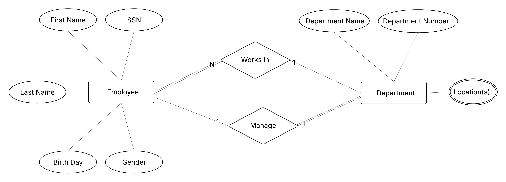
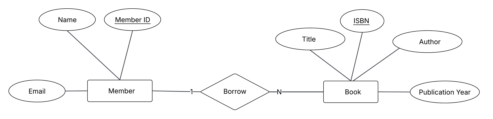
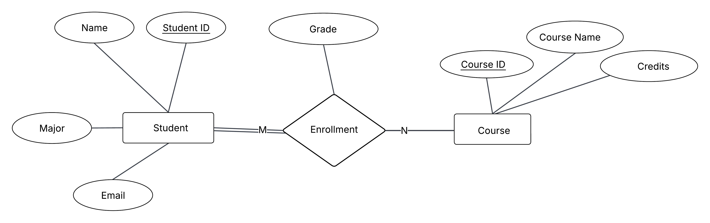
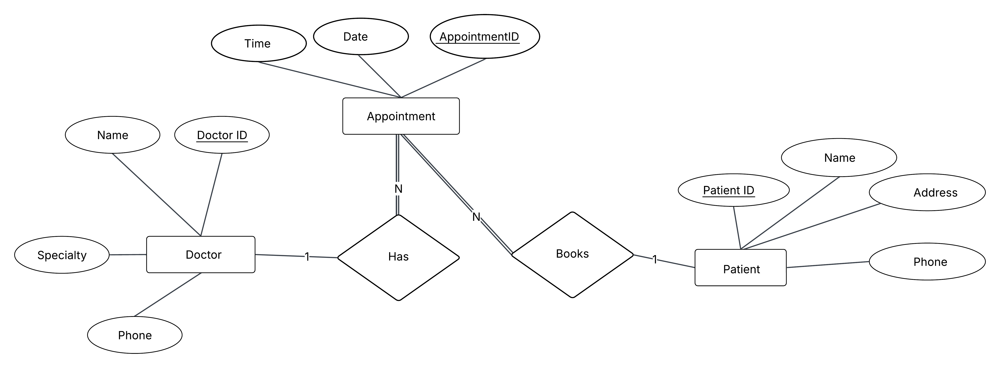
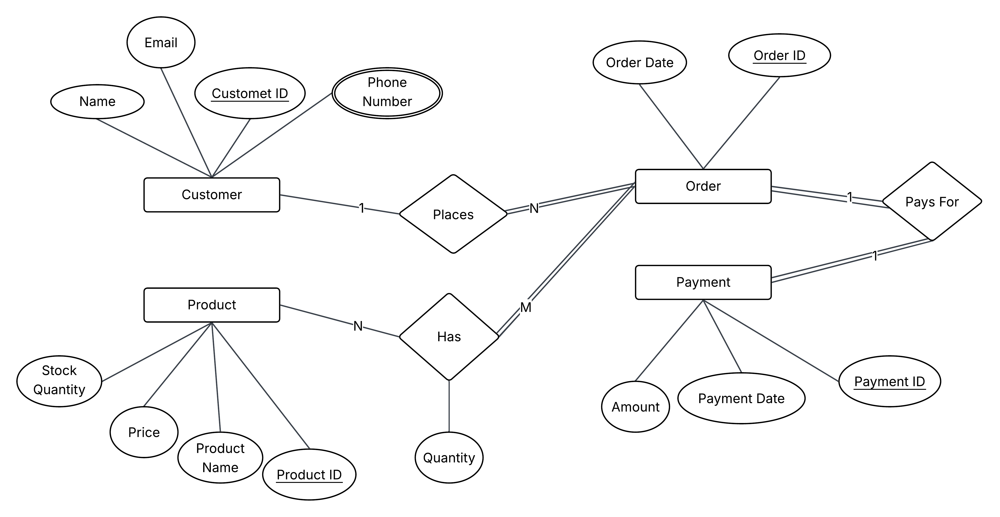
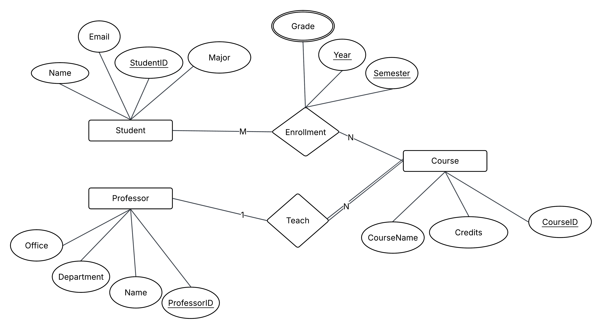
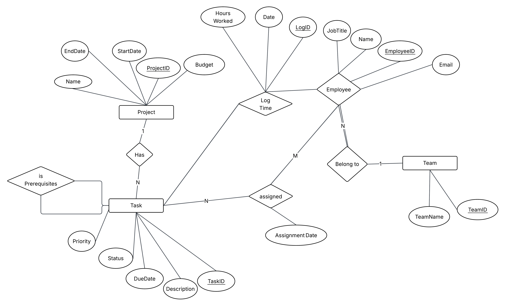

# Database Design Practice

Welcome to **Database Design Practice**!  
This repository is built to help you learn database design by practice.

---

## Table of Contents
- [Purpose](#purpose)  
- [Who is this for?](#who-is-this-for)  
- [How to Use](#how-to-use)  
- [Database Design Instructions: ERD to Relational Schema](#database-design-instructions-erd-to-relational-schema)
- [Problem 01: Company Employees and Departments](#problem-01-company-employees-and-departments)  
- [Solution 01: Company Employees and Departments](#solution-01-company-employees-and-departments)  
- [Problem 02: Library Books and Members](#problem-02-library-books-and-members)  
- [Solution 02: Library Books and Members](#solution-02-library-books-and-members)  
- [Problem 03: Students, Courses, and Enrollments](#problem-03-students-courses-and-enrollments)  
- [Solution 03: Students, Courses, and Enrollments](#solution-03-students-courses-and-enrollments)  
- [Problem 04: Hospital Management System](#problem-04-hospital-management-system)  
- [Solution 04: Hospital Management System](#solution-04-hospital-management-system)  
- [Problem 05: Online Shopping System](#problem-05-online-shopping-system)  
- [Solution 05: Online Shopping System](#solution-05-online-shopping-system)  
- [Problem 06: University Course Enrollment System](#problem-06-university-course-enrollment-system)  
- [Solution 06: University Course Enrollment System](#solution-06-university-course-enrollment-system)  
- [Problem 07: Project Management System](#problem-07-project-management-system)  
- [Solution 07: Project Management System](#solution-07-project-management-system)  

---

## Purpose
- Practice creating **Entity Relationship Diagrams (ERDs)**  
- Work on **simple, real-world scenarios**  
- Build skills step by step with **guided problems and solutions**  

---

## Who is this for?
- Absolute beginners in database design  
- Students or self-learners looking for hands-on ERD practice  
- Anyone who wants to strengthen their fundamentals in database design  

---

## How to Use
All problems and solutions are included directly in this README.  

1. Read a **Problem** section.  
2. Try to solve it on your own by identifying entities, attributes, and relationships.  
3. Draw your own ERD diagram.  
4. Scroll down to the matching **Solution** section to compare with the provided answer.  

---

## Database Design Instructions: ERD to Relational Schema

This section outlines the step-by-step process for converting an Entity-Relationship Diagram (ERD) into a relational database schema. Use it as a general guide when solving the problems in this repository.

### Step 1: Identify and Create Entity Tables

- Rule: Each entity type in your diagram becomes its own table.
- Action:
  1. Create a table for the entity.
  2. Convert the entity's attributes into columns in that table.
  3. Choose a Primary Key:
     - It can be a Simple (single column) or Composite (multiple columns) key.
     - It must be Not Null, Unique, and Minimal (no unnecessary columns).

Example: Create tables for `User`, `Post`, `PostImage`, `Like`, and `Comment`.

### Step 2: Handle 1:1 (One-to-One) Relationships

This depends on the participation constraint (Total or Partial) of the entities involved.

| Participation (S, T) | What to do? | Where to put Relationship Attributes? |
|----------------------|------------|---------------------------------------|
| Both Total (S: Total, T: Total) | Merge the two tables `S` and `T` into a single table. | Add them as columns in the merged table. |
| One Partial, One Total (S: Partial, T: Total) | Add a Foreign Key to the table with Total participation (`T`) that references the Primary Key of the other table (`S`). This FK can also become the PK of `T`. | Add them as columns to the table with the Foreign Key (`T`). |
| Both Partial (S: Partial, T: Partial) | Add a Foreign Key to either table `S` or `T` referencing the Primary Key of the other. | Add them as columns to the table you placed the Foreign Key in. |

### Step 3: Handle 1:N (One-to-Many) Relationships

- Identify the sides: which entity is on the "1" side (`T`) and which is on the "N" side (`S`).
- Action:
  1. Add a Foreign Key in the table on the "N" side (`S`) that refers to the Primary Key of the "1" side (`T`).
  2. Place any attributes of the relationship into the "N" side table.

Example: A User authors a Post (1:N). Add `author_id` in the `Post` table referencing `User(user_id)`.

### Step 4: Handle M:N (Many-to-Many) Relationships

- Action:
  1. Create a new table `R` to represent the relationship.
  2. Add relationship attributes as columns in `R`.
  3. Add Foreign Keys in `R` referencing the Primary Keys of both participating tables.
  4. The Primary Key of `R` is typically the combination of these Foreign Keys (composite key).

Example: A "Like" between `User` and `Post` becomes table `Like(user_id, post_id)`.

### How to Apply These Instructions

1. Start with Step 1. List all your entities and create a table for each.
2. For each relationship, determine its type (1:1, 1:N, or M:N).
3. Follow Steps 2–4 accordingly.
4. Add constraints (PK, FK, UNIQUE, CHECK) to enforce integrity.

---

## Problem 01: Company Employees and Departments

### Description
A company wants to store information about its employees and departments.  
You are asked to design an ERD for the following scenario:

- Each employee has: SSN, First Name, Last Name, Birth Date, and Gender.  
- Each department has: Department Number (unique), Department Name, and Location(s).  
- Each employee works in exactly one department.  
- A department can have multiple employees.  
- Each department has one manager.  

### Requirements
1. Identify the entities.  
2. Identify the attributes for each entity.  
3. Define the relationships between entities.  
4. Draw the ERD diagram.  
5. Map the ERD to relational schema.  
6. Write SQL code in PostgreSQL to create the schema.  

---

## Solution 01: Company Employees and Departments

### Entities and Attributes
- **Employee**
  - SSN (Primary Key)  
  - First Name  
  - Last Name  
  - Birth Date  
  - Gender  

- **Department**
  - Department Number (Primary Key)  
  - Department Name  
  - Location  

### Relationships
- **Works_In**: Each employee works in one department (1:N).  
- **Manages**: Each department has one manager (1:1 between Department and Employee).  

### ERD Diagram


### ER-to-Relational Mapping
- **Employee(SSN, FirstName, LastName, BirthDate, Gender, DeptNo)**  
- **Department(DeptNo, DeptName, Location, ManagerSSN)**  

### PostgreSQL Implementation
```sql
-- Create Department table
CREATE TABLE Department (
    DeptNo SERIAL PRIMARY KEY,
    DeptName VARCHAR(100) NOT NULL,
    Location VARCHAR(100),
    ManagerSSN CHAR(9) UNIQUE
);

-- Create Employee table
CREATE TABLE Employee (
    SSN CHAR(9) PRIMARY KEY,
    FirstName VARCHAR(50) NOT NULL,
    LastName VARCHAR(50) NOT NULL,
    BirthDate DATE NOT NULL,
    Gender CHAR(1) CHECK (Gender IN ('M', 'F')),
    DeptNo INT NOT NULL,
    FOREIGN KEY (DeptNo) REFERENCES Department(DeptNo),
    CONSTRAINT fk_manager FOREIGN KEY (SSN) REFERENCES Department(ManagerSSN)
);
```

---

## Problem 02: Library Books and Members

### Description
A small library wants to store information about its books and members.  
You are asked to design an ERD for the following scenario:

- Each book has: ISBN, Title, Author, and Publication Year.  
- Each member has: Member ID, Name, and Email.  
- A member can borrow many books.  
- A book can only be borrowed by one member at a time.  

### Requirements
1. Identify the entities.  
2. Identify the attributes for each entity.  
3. Define the relationships between entities.  
4. Draw the ERD diagram.  
5. Map the ERD to relational schema.  
6. Write SQL code in PostgreSQL to create the schema.  

---

## Solution 02: Library Books and Members

### Entities and Attributes
- **Book**
  - ISBN (Primary Key)  
  - Title  
  - Author  
  - PubYear  

- **Member**
  - MemberID (Primary Key)  
  - Name  
  - Email  

### Relationships
- **Borrows**: A member can borrow many books (1:N).  
- Each book is borrowed by at most one member.  

### ERD Diagram


### ER-to-Relational Mapping
- **Book(ISBN, Title, Author, PubYear, MemberID)**  
- **Member(MemberID, Name, Email)**  

### PostgreSQL Implementation
```sql
-- Create Member table
CREATE TABLE Member (
    MemberID SERIAL PRIMARY KEY,
    Name VARCHAR(100) NOT NULL,
    Email VARCHAR(100) UNIQUE NOT NULL
);

-- Create Book table
CREATE TABLE Book (
    ISBN CHAR(13) PRIMARY KEY,
    Title VARCHAR(200) NOT NULL,
    Author VARCHAR(100) NOT NULL,
    PubYear INT,
    MemberID INT,
    FOREIGN KEY (MemberID) REFERENCES Member(MemberID)
);
```

---

## Problem 03: Students, Courses, and Enrollments

### Description
A university wants to store information about its students, courses, and enrollments.  
You are asked to design an ERD for the following scenario:

- Each student has: Student ID, Name, Major, and Email.  
- Each course has: Course ID, Course Name, and Credits.  
- Students can enroll in many courses.  
- A course can have many students.  
- Each enrollment also stores the **Grade** the student received.  

### Requirements
1. Identify the entities.  
2. Identify the attributes for each entity.  
3. Define the relationships between entities.  
4. Draw the ERD diagram.  
5. Map the ERD to relational schema.  
6. Write SQL code in PostgreSQL to create the schema.  

---

## Solution 03: Students, Courses, and Enrollments

### Entities and Attributes
- **Student**
  - StudentID (Primary Key)  
  - Name  
  - Major  
  - Email  

- **Course**
  - CourseID (Primary Key)  
  - CourseName  
  - Credits  

- **Enrollment**
  - StudentID (Foreign Key)  
  - CourseID (Foreign Key)  
  - Grade  

### Relationships
- **Enrolls_In**:  
  - A student can enroll in many courses.  
  - A course can have many students.  
  - This is a many-to-many (M:N) relationship, resolved with the Enrollment table.  

### ERD Diagram


### ER-to-Relational Mapping
- **Student(StudentID, Name, Major, Email)**  
- **Course(CourseID, CourseName, Credits)**  
- **Enrollment(StudentID, CourseID, Grade)**  

### PostgreSQL Implementation
```sql
-- Create Student table
CREATE TABLE Student (
    StudentID SERIAL PRIMARY KEY,
    Name VARCHAR(100) NOT NULL,
    Major VARCHAR(100),
    Email VARCHAR(100) UNIQUE NOT NULL
);

-- Create Course table
CREATE TABLE Course (
    CourseID SERIAL PRIMARY KEY,
    CourseName VARCHAR(100) NOT NULL,
    Credits INT CHECK (Credits > 0)
);

-- Create Enrollment table (M:N relationship)
CREATE TABLE Enrollment (
    StudentID INT,
    CourseID INT,
    Grade CHAR(2),
    PRIMARY KEY (StudentID, CourseID),
    FOREIGN KEY (StudentID) REFERENCES Student(StudentID),
    FOREIGN KEY (CourseID) REFERENCES Course(CourseID)
);
```

---

## Problem 04: Hospital Management System

### Description
A hospital wants to manage data about doctors, patients, and appointments.  
You are asked to design an ERD for the following scenario:

- Each doctor has: DoctorID, Name, Specialty, and Phone.  
- Each patient has: PatientID, Name, Address, and Phone.  
- A doctor can have many appointments, but an appointment must belong to exactly one doctor.  
- A patient can have many appointments, but an appointment must belong to exactly one patient.  
- An appointment cannot exist without being linked to both a doctor and a patient.  
- Each appointment has: AppointmentID, Date, and Time.  

### Requirements
1. Identify the entities.  
2. Identify the attributes for each entity.  
3. Define the relationships between entities (detect the cardinality and participation).  
4. Draw the ERD diagram.  
5. Map the ERD to relational schema.  
6. Write SQL code in PostgreSQL to create the schema.  

---

## Solution 04: Hospital Management System

### Entities and Attributes
- **Doctor**
  - DoctorID (Primary Key)  
  - Name  
  - Specialty  
  - Phone  

- **Patient**
  - PatientID (Primary Key)  
  - Name  
  - Address  
  - Phone  

- **Appointment**
  - AppointmentID (Primary Key)  
  - Date  
  - Time  
  - DoctorID (Foreign Key)  
  - PatientID (Foreign Key)  

### Relationships
- **Doctor–Appointment**: 1:N  
- **Patient–Appointment**: 1:N  

### ERD Diagram


### ER-to-Relational Mapping
- **Doctor(DoctorID, Name, Specialty, Phone)**  
- **Patient(PatientID, Name, Address, Phone)**  
- **Appointment(AppointmentID, Date, Time, DoctorID, PatientID)**  

### PostgreSQL Implementation
```sql
-- Create Doctor table
CREATE TABLE Doctor (
    DoctorID SERIAL PRIMARY KEY,
    Name VARCHAR(100) NOT NULL,
    Specialty VARCHAR(100),
    Phone VARCHAR(20) UNIQUE
);

-- Create Patient table
CREATE TABLE Patient (
    PatientID SERIAL PRIMARY KEY,
    Name VARCHAR(100) NOT NULL,
    Address VARCHAR(200),
    Phone VARCHAR(20) UNIQUE
);

-- Create Appointment table
CREATE TABLE Appointment (
    AppointmentID SERIAL PRIMARY KEY,
    Date DATE NOT NULL,
    Time TIME NOT NULL,
    DoctorID INT NOT NULL,
    PatientID INT NOT NULL,
    FOREIGN KEY (DoctorID) REFERENCES Doctor(DoctorID),
    FOREIGN KEY (PatientID) REFERENCES Patient(PatientID)
);
```

---

## Problem 05: Online Shopping System  

### Description  
An online shopping platform wants to store information about customers, products, orders, and payments.  
You are asked to design an ERD for the following scenario:  

- Each customer has: CustomerID, Name, Email, and Phone Numbers (a customer can have multiple phone numbers).  
- Each product has: ProductID, ProductName, Price, and StockQuantity.  
- A customer can place many orders, but each order must belong to exactly one customer.  
- An order can include many products, and a product can appear in many orders. For each product in an order, the system stores the Quantity purchased.  
- Each order has: OrderID and OrderDate.  
- Each order must have one payment, and a payment must be linked to exactly one order.  
- A payment has: PaymentID, PaymentDate, and Amount.  

### Requirements  
1. Identify the entities.  
2. Identify the attributes for each entity.  
3. Identify any multi-valued attributes.  
4. Define the relationships between entities (detect the cardinality and participation).  
5. Draw the ERD diagram.  
6. Map the ERD to relational schema.  
7. Write SQL code in PostgreSQL to create the schema.  

---

## Solution 05: Online Shopping System  

### Entities and Attributes  
- **Customer**  
  - CustomerID (Primary Key)  
  - Name  
  - Email  
  - PhoneNumbers (Multi-valued)  

- **Product**  
  - ProductID (Primary Key)  
  - ProductName  
  - Price  
  - StockQuantity  

- **Order**  
  - OrderID (Primary Key)  
  - OrderDate  
  - CustomerID (Foreign Key)  

- **Payment**  
  - PaymentID (Primary Key)  
  - PaymentDate  
  - Amount  
  - OrderID (Foreign Key, Unique)  

- **OrderProduct (Associative Entity for M:N)**  
  - OrderID (Foreign Key)  
  - ProductID (Foreign Key)  
  - Quantity  

### Relationships  
- **Customer–Order**: 1:N  
- **Order–Product**: M:N (with Quantity attribute)  
- **Order–Payment**: 1:1  

### ERD Diagram  


### ER-to-Relational Mapping  
- **Customer(CustomerID, Name, Email)**  
- **CustomerPhone(CustomerID, PhoneNumber)**  
- **Product(ProductID, ProductName, Price, StockQuantity)**  
- **Order(OrderID, OrderDate, CustomerID)**  
- **Payment(PaymentID, PaymentDate, Amount, OrderID)**  
- **OrderProduct(OrderID, ProductID, Quantity)**  

### PostgreSQL Implementation  
```sql
-- Create Customer table
CREATE TABLE Customer (
    CustomerID SERIAL PRIMARY KEY,
    Name VARCHAR(100) NOT NULL,
    Email VARCHAR(100) UNIQUE NOT NULL
);

-- Create CustomerPhone table (multi-valued attribute)
CREATE TABLE CustomerPhone (
    CustomerID INT NOT NULL,
    PhoneNumber VARCHAR(20) NOT NULL,
    PRIMARY KEY (CustomerID, PhoneNumber),
    FOREIGN KEY (CustomerID) REFERENCES Customer(CustomerID)
);

-- Create Product table
CREATE TABLE Product (
    ProductID SERIAL PRIMARY KEY,
    ProductName VARCHAR(100) NOT NULL,
    Price DECIMAL(10,2) NOT NULL,
    StockQuantity INT NOT NULL
);

-- Create Order table
CREATE TABLE Orders (
    OrderID SERIAL PRIMARY KEY,
    OrderDate DATE NOT NULL,
    CustomerID INT NOT NULL,
    FOREIGN KEY (CustomerID) REFERENCES Customer(CustomerID)
);

-- Create Payment table (1:1 with Orders)
CREATE TABLE Payment (
    PaymentID SERIAL PRIMARY KEY,
    PaymentDate DATE NOT NULL,
    Amount DECIMAL(10,2) NOT NULL,
    OrderID INT UNIQUE NOT NULL,
    FOREIGN KEY (OrderID) REFERENCES Orders(OrderID)
);

-- Create OrderProduct table (M:N relationship)
CREATE TABLE OrderProduct (
    OrderID INT NOT NULL,
    ProductID INT NOT NULL,
    Quantity INT NOT NULL,
    PRIMARY KEY (OrderID, ProductID),
    FOREIGN KEY (OrderID) REFERENCES Orders(OrderID),
    FOREIGN KEY (ProductID) REFERENCES Product(ProductID)
);
```

---

## Problem 06: University Course Enrollment System  

### Description  
A university needs to store information about students, courses, professors, enrollments, and grades.  
You are asked to design an ERD for the following scenario:  

- Each student has: StudentID, Name, Major, and Email.  
- Each professor has: ProfessorID, Name, Department, and Office.  
- Each course has: CourseID, CourseName, and Credits.  
- A professor can teach many courses, but each course must be taught by exactly one professor.  
- A student can enroll in many courses, and a course can have many students.  
- For each enrollment, the system records the Semester and Year.  
- Each enrollment must also store a Grade (e.g., A, B, C, etc.).  
- A student may have multiple grades for the same course across different semesters.  
- Each enrollment record is uniquely identified by the combination of StudentID, CourseID, and Semester-Year.  

### Requirements  
1. Identify the entities.  
2. Identify the attributes for each entity.  
3. Identify if there are any weak entities.  
4. Define the relationships between entities (detect the cardinality and participation).  
5. Draw the ERD diagram.  
6. Map the ERD to relational schema.  
7. Write SQL code in PostgreSQL to create the schema.  

---

## Solution 06: University Course Enrollment System  

### Entities and Attributes  
- **Student**  
  - StudentID (Primary Key)  
  - Name  
  - Major  
  - Email  

- **Professor**  
  - ProfessorID (Primary Key)  
  - Name  
  - Department  
  - Office  

- **Course**  
  - CourseID (Primary Key)  
  - CourseName  
  - Credits  
  - ProfessorID (Foreign Key)  

- **Enrollment (Weak Entity)**  
  - StudentID (Foreign Key)  
  - CourseID (Foreign Key)  
  - Semester  
  - Year  
  - Grade  
  - (Primary Key = StudentID + CourseID + Semester + Year)  

### Relationships  
- **Professor–Course**: 1:N  
- **Student–Course**: M:N (via Enrollment, with attributes Semester, Year, Grade)  

### ERD Diagram  


### ER-to-Relational Mapping  
- **Student(StudentID, Name, Major, Email)**  
- **Professor(ProfessorID, Name, Department, Office)**  
- **Course(CourseID, CourseName, Credits, ProfessorID)**  
- **Enrollment(StudentID, CourseID, Semester, Year, Grade)**  

### PostgreSQL Implementation  
```sql
-- Create Student table
CREATE TABLE Student (
    StudentID SERIAL PRIMARY KEY,
    Name VARCHAR(100) NOT NULL,
    Major VARCHAR(100),
    Email VARCHAR(100) UNIQUE
);

-- Create Professor table
CREATE TABLE Professor (
    ProfessorID SERIAL PRIMARY KEY,
    Name VARCHAR(100) NOT NULL,
    Department VARCHAR(100),
    Office VARCHAR(50)
);

-- Create Course table
CREATE TABLE Course (
    CourseID SERIAL PRIMARY KEY,
    CourseName VARCHAR(100) NOT NULL,
    Credits INT NOT NULL,
    ProfessorID INT NOT NULL,
    FOREIGN KEY (ProfessorID) REFERENCES Professor(ProfessorID)
);

-- Create Enrollment table (Weak Entity for M:N relationship with attributes)
CREATE TABLE Enrollment (
    StudentID INT NOT NULL,
    CourseID INT NOT NULL,
    Semester VARCHAR(20) NOT NULL,
    Year INT NOT NULL,
    Grade CHAR(2),
    PRIMARY KEY (StudentID, CourseID, Semester, Year),
    FOREIGN KEY (StudentID) REFERENCES Student(StudentID),
    FOREIGN KEY (CourseID) REFERENCES Course.CourseID
);
```

---

## Problem 07: Project Management System

### Description
A software company needs a system to manage its projects, tasks, and employees. The system must track project details, task assignments, team compositions, and task dependencies.
You are asked to design an ERD for the following scenario:

- The system manages multiple **Projects**. Each project has a ProjectID, Name, StartDate, EndDate, and Budget.
- Each project is composed of multiple **Tasks**. Each task has a TaskID, Description, DueDate, Status (e.g., 'To Do', 'In Progress', 'Done'), and Priority (e.g., 'High', 'Medium', 'Low'). A task must belong to exactly one project.
- Tasks can have dependencies. A task can be a prerequisite for one or more other tasks. This creates a self-referencing relationship on the Task entity.
- The company has **Employees**. Each employee has an EmployeeID, Name, Email, and JobTitle.
- Employees are organized into **Teams**. Each team has a TeamID and a TeamName. An employee can belong to only one team at a time, but a team consists of many employees.
- Tasks are assigned to employees. An employee can be assigned many tasks, and a task can be assigned to multiple employees (a joint task). For each assignment, the system should record the date of assignment.
- The system also needs to track **TimeLogs**. An employee can log time spent on a specific task. Each time log entry should have a LogID, HoursWorked, and the date the work was performed.

### Requirements
1. Identify all the entities.
2. Identify the attributes for each entity, including primary and foreign keys.
3. Identify any weak entities.
4. Define the relationships between entities (detect the cardinality and participation).
5. Represent any self-referencing (recursive) relationships.
6. Draw the ERD diagram.
7. Map the ERD to a relational schema.
8. Write SQL code in PostgreSQL to create the schema.

---

## Solution 07: Project Management System

### Entities and Attributes
- **Project**
  - ProjectID (Primary Key)
  - Name
  - StartDate
  - EndDate
  - Budget

- **Task**
  - TaskID (Primary Key)
  - Description
  - DueDate
  - Status
  - Priority
  - ProjectID (Foreign Key)

- **TaskDependency (Associative Entity for Task's recursive relationship)**
  - PrerequisiteTaskID (Foreign Key)
  - DependentTaskID (Foreign Key)
  - PRIMARY KEY (PrerequisiteTaskID, DependentTaskID)

- **Employee**
  - EmployeeID (Primary Key)
  - Name
  - Email
  - JobTitle
  - TeamID (Foreign Key)

- **Team**
  - TeamID (Primary Key)
  - TeamName

- **TaskAssignment (Associative Entity for Employee-Task)**
  - EmployeeID (Foreign Key)
  - TaskID (Foreign Key)
  - AssignmentDate
  - PRIMARY KEY (EmployeeID, TaskID)

- **TimeLog**
  - LogID (Primary Key)
  - HoursWorked
  - LogDate
  - EmployeeID (Foreign Key)
  - TaskID (Foreign Key)

### Relationships
- **Project–Task**: 1:N (One Project has many Tasks). A Task must belong to exactly one Project.
- **Team–Employee**: 1:N (One Team has many Employees). An Employee belongs to one Team.
- **Task–Task (Dependency)**: M:N (Recursive) via TaskDependency.
- **Employee–Task (Assignment)**: M:N via TaskAssignment.
- **Employee–Task (Time Logging)**: TimeLog references both (each TimeLog belongs to exactly one Employee and one Task).

### ERD Diagram


### ER-to-Relational Mapping
- **Project(<u>ProjectID</u>, Name, StartDate, EndDate, Budget)**
- **Team(<u>TeamID</u>, TeamName)**
- **Employee(<u>EmployeeID</u>, Name, Email, JobTitle, *TeamID*)**
- **Task(<u>TaskID</u>, Description, DueDate, Status, Priority, *ProjectID*)**
- **TaskDependency(<u>*PrerequisiteTaskID*</u>, <u>*DependentTaskID*</u>)**
- **TaskAssignment(<u>*EmployeeID*</u>, <u>*TaskID*</u>, AssignmentDate)**
- **TimeLog(<u>LogID</u>, HoursWorked, LogDate, *EmployeeID*, *TaskID*)**

### PostgreSQL Implementation
```sql
-- Create Project table
CREATE TABLE Project (
    ProjectID SERIAL PRIMARY KEY,
    Name VARCHAR(100) NOT NULL,
    StartDate DATE,
    EndDate DATE,
    Budget DECIMAL(12, 2)
);

-- Create Team table
CREATE TABLE Team (
    TeamID SERIAL PRIMARY KEY,
    TeamName VARCHAR(100) UNIQUE NOT NULL
);

-- Create Employee table
CREATE TABLE Employee (
    EmployeeID SERIAL PRIMARY KEY,
    Name VARCHAR(100) NOT NULL,
    Email VARCHAR(100) UNIQUE NOT NULL,
    JobTitle VARCHAR(50),
    TeamID INT,
    FOREIGN KEY (TeamID) REFERENCES Team(TeamID) ON DELETE SET NULL
);

-- Create Task table
CREATE TABLE Task (
    TaskID SERIAL PRIMARY KEY,
    Description TEXT NOT NULL,
    DueDate DATE,
    Status VARCHAR(20) NOT NULL DEFAULT 'To Do',
    Priority VARCHAR(20) NOT NULL DEFAULT 'Medium',
    ProjectID INT NOT NULL,
    FOREIGN KEY (ProjectID) REFERENCES Project(ProjectID) ON DELETE CASCADE
);

-- Create TaskDependency table (M:N recursive relationship on Task)
CREATE TABLE TaskDependency (
    PrerequisiteTaskID INT NOT NULL,
    DependentTaskID INT NOT NULL,
    PRIMARY KEY (PrerequisiteTaskID, DependentTaskID),
    FOREIGN KEY (PrerequisiteTaskID) REFERENCES Task(TaskID) ON DELETE CASCADE,
    FOREIGN KEY (DependentTaskID) REFERENCES Task(TaskID) ON DELETE CASCADE,
    CHECK (PrerequisiteTaskID <> DependentTaskID)
);

-- Create TaskAssignment table (M:N between Employee and Task)
CREATE TABLE TaskAssignment (
    EmployeeID INT NOT NULL,
    TaskID INT NOT NULL,
    AssignmentDate DATE NOT NULL DEFAULT CURRENT_DATE,
    PRIMARY KEY (EmployeeID, TaskID),
    FOREIGN KEY (EmployeeID) REFERENCES Employee(EmployeeID) ON DELETE CASCADE,
    FOREIGN KEY (TaskID) REFERENCES Task(TaskID) ON DELETE CASCADE
);

-- Create TimeLog table
CREATE TABLE TimeLog (
    LogID SERIAL PRIMARY KEY,
    HoursWorked DECIMAL(4, 2) NOT NULL,
    LogDate DATE NOT NULL,
    EmployeeID INT NOT NULL,
    TaskID INT NOT NULL,
    FOREIGN KEY (EmployeeID) REFERENCES Employee(EmployeeID) ON DELETE CASCADE,
    FOREIGN KEY (TaskID) REFERENCES Task(TaskID) ON DELETE CASCADE
);
```

---

Happy designing! Feel free to suggest additional problems or contribute improvements via pull requests.
